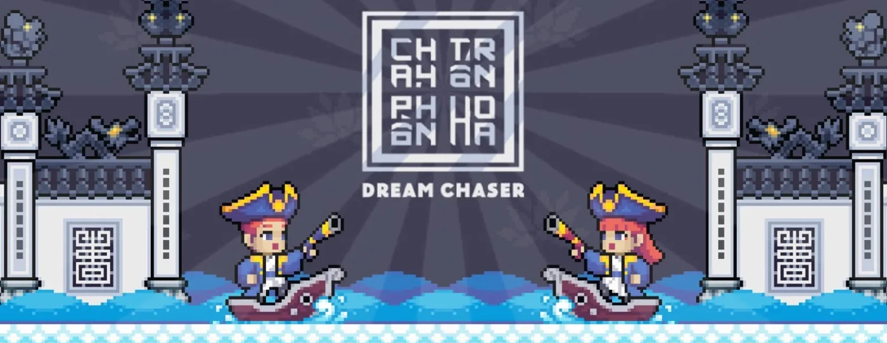
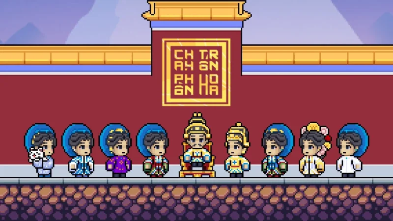
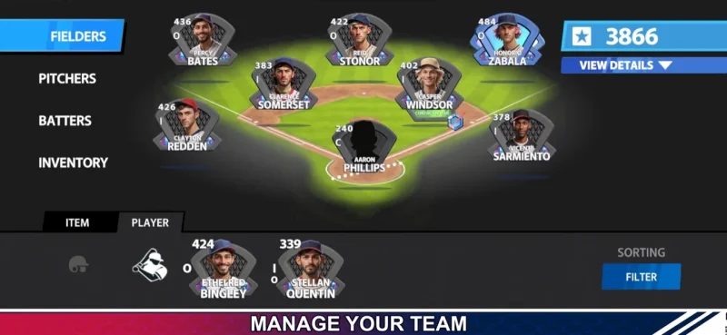
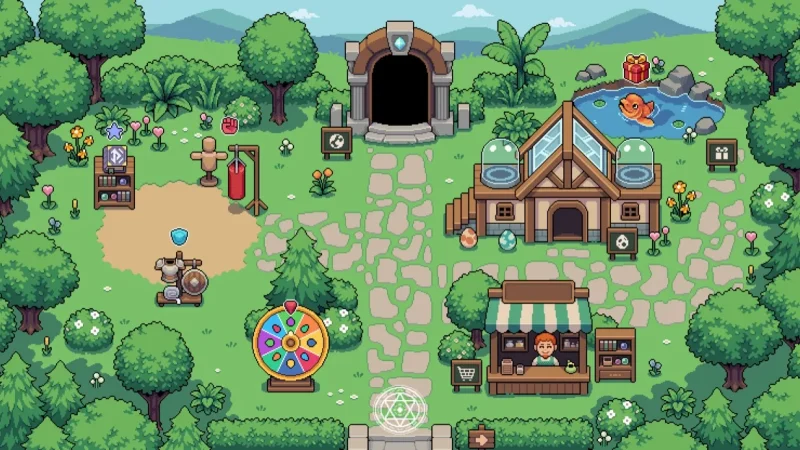
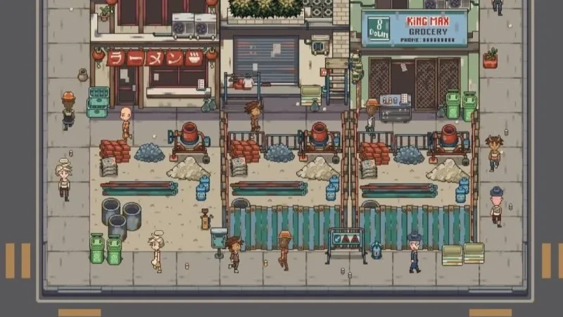

## Phạm Duy Phúc &nbsp;·&nbsp; Dan / Daniel

<picture>
  <source media="(prefers-color-scheme: dark)" srcset="https://streak-stats.demolab.com/?user=Daniel-Pham831&hide_border=true&background=00000000&stroke=30363D&ring=E8722F&fire=E8722F&currStreakNum=E6EDF3&sideNums=E6EDF3&currStreakLabel=E8722F&sideLabels=8B949E&dates=8B949E">
  <source media="(prefers-color-scheme: light)" srcset="https://streak-stats.demolab.com/?user=Daniel-Pham831&hide_border=true&background=00000000&stroke=D0D7DE&ring=C4451C&fire=C4451C&currStreakNum=1F2328&sideNums=1F2328&currStreakLabel=C4451C&sideLabels=636C76&dates=636C76">
  
</picture>

<b>Unity Game Developer</b> &nbsp;·&nbsp; Saigon, Vietnam

<i>I make games that actually ship.</i>

  
  
  
  

 

---

Nearly **5 years** building commercial games for studios in **Canada**, the **UK** and **Japan**. I own gameplay systems end to end — architecture, simulation, complex UI, performance — and I take things all the way to the store, not just to a playable build.

**Right now**

- 🎮 &nbsp;Unity developer at **IndiGames** — mobile titles for Japanese clients, live-service on Firebase + Remote Config
- 🌐 &nbsp;Building **Magic Monster**, a pet-collector × idle RPG, on a real-time multiplayer backend I wrote in **SpacetimeDB / Rust**
- 🍜 &nbsp;Solo-developing **Strixel**, an idle tycoon set on an old Saigon food street

 

## Selected work

<table>
<tr>
<td width="50%" valign="top">

**Dream Chaser** · *Chạy Trốn Phồn Hoa* — **lead developer**

A pixel endless-runner set in Nguyễn-dynasty Vietnam, built with my art partner Hiệp — just the two of us. Full game architecture and every core gameplay system, prototype through live release.

`Unity` `C#` — 100K installs · 4.7★ · 23.3M impressions

[App Store](https://apps.apple.com/vn/app/id6474929639) · [Apple's story](https://apps.apple.com/story/id1750600803)

</td>
<td width="50%" valign="top">

**The Ball Game by Playbrk** — **visual simulation layer**

A baseball management and tycoon sim, published by Magmic. I built the layer that turns runtime match data into something you can watch — player placement, visuals, animation timing — plus the narrative 3D cutscenes.

`Unity` `C#` — iOS / iPad / Mac, 2024

[App Store](https://apps.apple.com/vn/app/the-ball-game-by-playbrk/id6758020837)

</td>
</tr>
<tr>
<td width="50%" valign="top">

**Magic Monster** *(working title)* — **systems & backend**

Hatch and evolve pixel pets, send them on idle expeditions, and roam a shared plaza where players see each other but never fight. I lead the systems and the real-time multiplayer backend.

`Unity 6` `URP 2D` `SpacetimeDB (Rust)` — in development

</td>
<td width="50%" valign="top">

**Strixel** — **solo, everything**

An idle tycoon on an old Saigon food street: build stalls, hire staff, grow a block until it hums. Ten months went into the simulation foundation — building, character AI, pathfinding, day/night, economy.

`Unity` `C#` — since Jun 2024

</td>
</tr>
</table>

> **Also, 2025 → now:** 4+ mobile titles for Japanese clients at IndiGames, 2 shipped. Under NDA, so they can't be shown here — happy to walk through the work in a call.

 

## Toolbox

**Shipping & live-service**

           

**Monetization & analytics**

       

**Performance**

         

**Engine & gameplay**

            

**UI**

     

**Architecture & async**

      

**Multiplayer & backend**

         

**Editor tooling & process**

      

**Everything else**

     

 

## Recognition

<table>
<tr><td><b>Apple App Store feature</b></td><td><i>"Here's to the Dreamers — Dare to Dream"</i>, featured across Southeast Asia · 2024</td></tr>
<tr><td><b>Best Mobile — winner</b></td><td>Dream Chaser, Indie Games Awards Vietnam</td></tr>
<tr><td><b>MIRO Game Contest — 3rd</b></td><td>Dream Chaser, team PVN Studio · 2024</td></tr>
<tr><td><b>Most-loved video demo</b></td><td>A second MIRO award the same year</td></tr>
<tr><td><b>WeChoice — nominee</b></td><td>Z-Team, talented Gen-Z groups — with Hiệp</td></tr>
<tr><td><b>Employee of the Year</b></td><td>One of three named at Magmic · 2024</td></tr>
</table>

Press — <a href="https://vnexpress.net/apple-vinh-danh-hai-nha-phat-trien-viet-trong-du-an-dam-uoc-mo-4780060.html">VnExpress</a> · <a href="https://thanhnien.vn/game-chay-tron-phon-hoa-duoc-apple-vinh-danh-185240917191411922.htm">Thanh Niên</a> · <a href="https://cafef.vn/gap-doi-ban-tre-dung-sau-chay-tron-phon-hoa-tua-game-dua-ban-sac-van-hoa-viet-nam-den-lang-game-the-gioi-188240811080328091.chn">CafeF</a> · <a href="https://www.hardwarezone.com.sg/entertainment/gaming/feature-apple-app-store-game-development-dreamchaser-vietnam">HardwareZone</a>

 

## Also on GitHub

Most of my day job lives in private repos, so what's public here is the side of me that builds things for fun — algorithms, tools and frameworks.

- **[ManiacFramework](https://github.com/Daniel-Pham831/ManiacFramework)** — a small Unity framework I use across projects
- **[Maze Generator & Pathfinding](https://github.com/Daniel-Pham831/Visualize-a-Maze-Generator-and-some-Path-Finding-algorithms-In-Java)** — Java Swing visualiser for maze generation and pathfinding
- **[TankTankBum](https://github.com/Daniel-Pham831/TankTankBum)** — a 3D multiplayer tank game
- **[Multiplayer-Template](https://github.com/Daniel-Pham831/Multiplayer-Template)** — self-made Unity multiplayer starter
- **[Boidz](https://github.com/Daniel-Pham831/Boidz)** — boids flocking, with an eye on optimisation

---

Open to interesting Unity, gameplay and multiplayer work — full-time or collaboration. 
<a href="mailto:phamphuc0603@gmail.com">phamphuc0603@gmail.com</a> &nbsp;·&nbsp;
<a href="https://daniel-pham831.github.io/portfolio/">daniel-pham831.github.io/portfolio</a>

